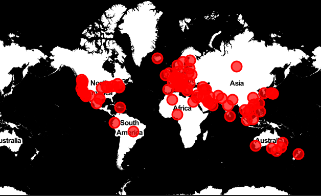
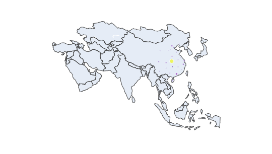

---
title: "Python带你了解世界疫情"
author: "赵凯力"
date: "2020-02"
output:
  bookdown::html_document2:
    fig_caption: true
    highlight: haddock
    keep_md: true
    md_extensions: +east_asian_line_breaks
    number_sections: true
    pandoc_args:
    - --filter
    - pandoc-crossref
    - -M
    - eqnPrefix=
    seq_numbering: false
    toc: true
  bookdown::pdf_document2:
    keep_tex: true
    latex_engine: xelatex
    md_extensions: +east_asian_line_breaks
    pandoc_args:
    - --listing
    - --filter
    - pandoc-crossref
    toc: false
  slidy_presentation:
    highlight: haddock
  bookdown::word_document2:
    fig_caption: true
    md_extensions: +east_asian_line_breaks
    pandoc_args:
    - --filter
    - pandoc-crossref
    reference_docx: ./style/word-styles-02.docx
  ioslides_presentation:
    highlight: haddock
    slide_level: 3
  beamer_presentation:
    keep_tex: true
    latex_engine: xelatex
    toc: true
    pandoc_args:
    - --listing
    - --filter
    - pandoc-crossref
    slide_level: 3
    template: ./style/beamer-template.tex
csl: ./style/chinese-gb7714-2005-numeric.csl
css: ./style/markdown.css
bibliography: Bibfile.bib
eqnPrefixTemplate: ($$i$$)
institute: 中南财经政法大学统计与数学学院
link-citations: true
linkReferences: true
chapters: true
tableEqns: false
autoEqnLabels: false
---


```{r setup, echo=F, purl=F}
knitr::opts_knit$set(root.dir = getwd())
knitr::opts_chunk$set(echo = TRUE, results = 'hide')
knitr::opts_chunk$set(warning = FALSE, message=FALSE)
knitr::opts_chunk$set(out.height="0.5\\textwidth", fig.width=5, fig.height=3, fig.align="center")
```

```{r prepare, echo=F, purl=F}
rm(list=ls())
options(digits=4)
options(scipen=100)
graphics.off()
Sys.setlocale("LC_ALL", "Chinese")
```
# 数据读取和处理
首先当导入必备的包
```{python}
import numpy as np
import pandas as pd
```
然后就是导入数据，数据已经从github上下载，共三个文件，
分别是疫情的确诊数（confirmed），治愈数（recoved），死亡数（deaths），
基本上每日会更新最新疫情数据。
```{python}
confirmed = pd.read_csv(r'.\COVID-19\csse_covid_19_data\csse_covid_19_time_series\time_series_19-covid-Confirmed.csv')
recovered = pd.read_csv(r'.\COVID-19\csse_covid_19_data\csse_covid_19_time_series\time_series_19-covid-Recovered.csv')
deaths = pd.read_csv(r'.\COVID-19\csse_covid_19_data\csse_covid_19_time_series\time_series_19-covid-Deaths.csv')
```
数据已经导入,接下来查看数据的基本情况。head()
是查看数据前五行；confirmed表里面包含发生疫情的国
家，经纬度，以及从2020年1月22日至今的每日的确诊
数；recovered表则记录了治愈数；deaths表则记录了死亡数。
```{python, echo=F}
confirmed.head().to_csv("./mydata/confirmed_head.csv", index=False)
recovered.head().to_csv("./mydata/recovered_head.csv", index=False)
deaths.head().to_csv("./mydata/deaths_head.csv", index=False)
```
```{python}
confirmed.head()
```
```{r , results='markup', echo=F}
library(knitr)
library(tibble)
confirmed_head <- read.csv("./mydata/confirmed_head.csv", header=T, check.names = F)
a <- confirmed_head[, c(1:5, 44)]
a <- add_column(a, ...=c('...','...','...','...','...'), .after="1/22/20")
kable(a,row.names =F,align = "c", caption="confirmed的前五行",
      longtable = T, booktabs = T, linesep="")
```

```{python}
recovered.head()
```
```{r , results='markup', echo=F}
confirmed_head <- read.csv("./mydata/recovered_head.csv", header=T, check.names = F)
a <- confirmed_head[, c(1:5, 44)]
a <- add_column(a, ...=c('...','...','...','...','...'), .after="1/22/20")
kable(a,row.names =F,align = "c", caption="recovered的前五行",
      longtable = T, booktabs = T, linesep="")
```

```{python}
deaths.head()
```
```{r , results='markup', echo=F}
confirmed_head <- read.csv("./mydata/deaths_head.csv", header=T, check.names = F)
a <- confirmed_head[, c(1:5, 44)]
a <- add_column(a, ...=c('...','...','...','...','...'), .after="1/22/20")
kable(a,row.names =F,align = "c", caption="deaths的前五行",
      longtable = T, booktabs = T, linesep="")
```

# 数据可视化
导入matplotlib绘图包画图
```{python}
import matplotlib.pyplot as plt 
plt.rcParams['font.sans-serif'] = ['SimHei'] #用来正常显示中文标签
plt.rcParams['axes.unicode_minus'] = False   #用来正常显示负号
```
首先看看在我们的数据中，哪些地区发生了疫情。可以看出一共
61个地区都有新冠肺炎病例。
```{python}
countries = confirmed['Country/Region'].unique()
print(countries)
countries.shape[0]
```
接下来看看世界疫情发展趋势，我们的数据还需要再整理下，要
计算出每日所有地区新冠肺炎的确诊数，治愈数，死亡数。
```{python}
all_confirmed = np.sum(confirmed.iloc[:,4:])
#np.sum()函数传入数据框默认对每一列求和，结果是series
all_recovered = np.sum(recovered.iloc[:,4:])
all_deaths = np.sum(deaths.iloc[:,4:])
```

下面就可以画出疫情发展趋势图了,见图\@ref(fig:fig1)。
```{python fig1, fig.cap="全球疫情变化趋势"}
plt.figure(figsize=(12, 6))
plt.plot(all_confirmed, color='r', label='确诊', marker='o')
plt.plot(all_deaths, color='lime', label='死亡', marker='o')
plt.plot(all_recovered, color='b', label='治愈', marker='o')
plt.xticks(all_confirmed.index[::2],rotation = 45,size = 13)
plt.yticks(size=20)
plt.xlabel('时 间',size = 20)
plt.ylabel('数 目',size = 20)
plt.legend(loc = "upper left",fontsize = 20)
plt.tight_layout()
plt.show()
```

可以看出，目前新冠肺炎确诊病例还在持续增加，不过令人高兴的是治愈数
也在持续增长，死亡数很少，希望疫情拐点早日出现，疫情早日结束。


下面看看新冠肺炎的死亡率，首先计算死亡率数据，然后就可以直接画图,见图\@ref(fig:fig2)。
```{python fig2, fig.cap="全球疫情死亡率"}
death_rate = (all_deaths/all_confirmed)*100
plt.figure(figsize=(12, 6))
plt.plot(death_rate,color = 'lime',label = '死亡',marker = 'o')
plt.xticks(all_confirmed.index[::2],rotation = 45,size = 13)
plt.yticks(size = 15)
plt.xlabel('时 间',size = 20)
plt.ylabel('死亡率',size = 20)
plt.tight_layout()
plt.show()
```

由于本次疫情主要发生在中国大陆，下面来具体研究下中国大陆
的疫情情况，首先从全部数据中提取出中国大陆的数据。里面包
含了省份，以及每个省最新的确诊数，治愈数，死亡数。
```{python}
last_update = '3/01/20'  # 设置最新数据日期
China_cases = confirmed[['Province/State',last_update]][confirmed['Country/Region'] == 'Mainland China']
China_cases['recovered'] = recovered[[last_update]][recovered['Country/Region']=='Mainland China']
China_cases['deaths']=deaths[[last_update]][deaths['Country/Region']=='Mainland China']
China_cases.set_index('Province/State', inplace=True)
China_cases = China_cases.rename(columns = {last_update:'confirmed'})
print(China_cases)
```
```{python, echo=F}
China_cases.to_csv("./mydata/China_cases.csv")
```
```{r, echo=F}
cases <- read.csv("./mydata/China_cases.csv", head=T)
kable(cases ,align = "c", caption="中国各省疫情情况分布",longtable = T, booktabs = T, linesep="")
```
下面画出中国大陆每个省份的疫情数量图。(图\@ref(fig:fig3))
```{python fig3, fig.cap="中国大陆各省市疫情数量", fig.height=40,fig.width=30}
Mainland_china = China_cases.sort_values(by='confirmed',ascending=True)
Mainland_china.plot(kind='barh', figsize=(40, 20),color = ['red','blue','lime'], width=1, rot=2)
plt.ylabel('省/市',size=20)
plt.xlabel('数量',size=20)
plt.yticks(size=20)
plt.xticks(size=20)
plt.legend(bbox_to_anchor=(0.95,0.95),fontsize = 20)
plt.tight_layout()
plt.show()
```

可以看到，湖北省三项数据高居第一位，且远远高于其他省份。
下面看看中国大陆的治愈率和死亡率数据，数据使用下面的代码
即可计算出来，最终结果在recover_rate和death_rate里。
```{python}
confirmed_china = confirmed[confirmed['Country/Region']=='Mainland China']
confirmed_china = np.sum(confirmed_china.iloc[:,4:])
recovered_china = recovered[recovered['Country/Region'] == 'Mainland China']
recovered_china = np.sum(recovered_china.iloc[:,4:])
deaths_china = deaths[deaths['Country/Region'] == 'Mainland China']
deaths_china = np.sum(deaths_china.iloc[:,4:])
recover_rate = (recovered_china/confirmed_china)*100
death_rate = (deaths_china/confirmed_china)*100
```
接下来就是画图了(图\@ref(fig:fig4))
```{python fig4, fig.cap="中国大陆治愈率 VS 死亡率"}
plt.figure(figsize=(12, 6))
plt.plot(recover_rate, color = 'blue', label = '治愈率', marker = 'o')
plt.plot(death_rate, color = 'lime', label = '死亡率', marker = 'o')
plt.ylabel('数量',size=15)
plt.xlabel('时间',size=15)
plt.xticks(all_confirmed.index[::2], rotation=45,size=13)
plt.yticks(size=15)
plt.legend(loc = "upper left",fontsize = 20)
plt.tight_layout()
plt.show()
```

虽然在1月25日-1月31日期间死亡率略高于治愈率，但其他时间段，
治愈率远远高于死亡率，这都得益于全国广大医务人员的不懈努力！
然后来看中国大陆以外的其他地区情况。
```{python}
confirmed_others = confirmed[confirmed['Country/Region'] != 'Mainland China']
confirmed_others = np.sum(confirmed_others.iloc[:,4:])
recovered_others = recovered[recovered['Country/Region'] != 'Mainland China']
recovered_others = np.sum(recovered_others.iloc[:,4:])
deaths_others = deaths[deaths['Country/Region'] != 'Mainland China']
deaths_others = np.sum(deaths_others.iloc[:,4:])
recover_rate = (recovered_others/confirmed_others)*100
death_rate = (deaths_others/confirmed_others)*100
```
然后就是画图了。(图\@ref(fig:fig5))
```{python fig5, fig.cap="其他地区治愈率 VS 死亡率"}
plt.figure(figsize=(12, 6))
plt.plot(recover_rate, color = 'blue', label = '治愈率', marker = 'o')
plt.plot(death_rate, color = 'lime', label = '死亡率', marker = 'o')
plt.ylabel('数量',size=15)
plt.xlabel('时间',size=15)
plt.xticks(all_confirmed.index[::2], rotation=45,size=13)
plt.yticks(size=15)
plt.legend(loc = "upper left",fontsize = 20)
plt.tight_layout()
plt.show()
```

接下来看看其他地区疫情数量。
```{python}
others = confirmed[['Country/Region',last_update]][confirmed['Country/Region'] != 'Mainland China']
others['recovered'] = recovered[[last_update]][recovered['Country/Region'] != 'Mainland China']
others['death'] = deaths[[last_update]][deaths['Country/Region'] != 'Mainland China']
others_countries = others.rename(columns = {last_update:'confirmed'})
others_countries = others_countries.set_index('Country/Region')
others_countries = others_countries.groupby('Country/Region').sum()
sorted = others_countries.sort_values(by = 'confirmed',ascending=True)
```
然后画图(图\@ref(fig:fig6))
```{python fig6, fig.cap="世界其他地区疫情数量", fig.height=40,fig.width=30}
sorted.plot(kind='barh', figsize=(40, 20),color = ['red','blue','lime'], width=1,rot=2)
plt.ylabel('Country/Region',size = 20)
plt.xlabel('数量',size = 20)
plt.yticks(size=20)
plt.xticks(size=20)
plt.legend(bbox_to_anchor=(0.95,0.95),fontsize = 20)
plt.tight_layout()
plt.show()
```

从图可以看到，韩国，意大利，日本这些地区也有很多新冠肺炎患者。

# 绘制疫情地图
使用folium包绘制地图，在前面数据里加入中国大陆的数据，并使用武汉的经纬度。
```{python}
others=confirmed[['Country/Region','Lat','Long',last_update]][confirmed['Country/Region'] != 'Mainland China']
others['recovered'] = recovered[[last_update]][recovered['Country/Region'] != 'Mainland China']
others['death'] = deaths[[last_update]][deaths['Country/Region'] != 'Mainland China']
others_countries = others.rename(columns = {last_update:'confirmed'})
others_countries.loc['94'] = ['Mainland China',30.9756,112.2707,confirmed_china[-1],recovered_china[-1],deaths_china[-1]]
others_countries.to_csv("./mydata/others_countries.csv")
```
然后开始正式构建地图
```{python}
import folium
world_map = folium.Map(location=[10, -20], zoom_start=2.3,tiles='Stamen Toner')
```
上面一行是定义一个world_map对象；location的格式为[纬度,经度]；
zoom_start表示初始地图的缩放尺寸，数值越大放大程度越大；
tiles为地图类型，用于控制绘图调用的地图样式，默认为'OpenStreetMap'，
也有一些其他的内建地图样式，如'Stamen  Terrain'、'Stamen Toner'
、'Mapbox Bright'、'Mapbox Control Room'等；也可以传入'None'来
绘制一个没有风格的朴素地图，或传入一个URL来使用其它的自选osm。

然后往world_map里添加其他元素，注意这里的for循环和最后的add_to是
把经纬度点的信息一个一个的加进去
```{python}
for lat, lon, value, name in zip(others_countries['Lat'], others_countries['Long'], others_countries['confirmed'], others_countries['Country/Region']):
    folium.CircleMarker([lat, lon],
                            radius=10,
                            popup = ('<strong>Country</strong>: ' + str(name).capitalize() + '<br>'                                
                            '<strong>Confirmed Cases</strong>: ' + str(value) + '<br>'),                        
                            color='red',                                                
                            fill_color='red',                        
                            fill_opacity=0.7 ).add_to(world_map)
```
这里主要说下popup参数
popup：str型或folium.Popup()对象输入，用于控制标记部件的具体样式（folium内部自建了许多样式）
，默认为None，即不显示部件。代码使用的是自定义的网页样式，其中<strong>表示加粗
，<br>表示换行，以便将各个数据显示出来。

然后再运行world_map，即可出现如图图\@ref(fig:fig7)的地图样式，这是一种可交互的地图，可以随意移动缩放，鼠标点击地图上红点，即可出现地区的疫情信息。
```{python, echo=F}
world_map
```
```{r fig7, echo=F,fig.cap="全球疫情变化图",fig.height=10,fig.width=15,cache=F,dev="png",results='markup'}

```
接下来使用plotly绘制每日疫情扩散地图，首先是导入包
```{python}
import plotly.express as px
```
想绘制每日疫情扩散地图，需要增加一列，里面记录了每天的日期，因此我们的数据还需要再重新整理下，
这里需要用的melt函数，它将列名转换为列数据(columns name → column values)，重构mydataFrame
```{python}
confirmed = confirmed.melt(id_vars = ['Province/State', 'Country/Region', 'Lat', 'Long'], var_name='date',value_name = 'confirmed')
```
主要参数说明,id_vars:不需要被转换的列名。
value_vars:需要转换的列名，如果剩下的列全部都要转换，就不用写了。
var_name和value_name是自定义设置对应的列名。
重新得到的数据如下，新增了date一列，记录时间。还需要把date列转换成datetime格式的数据

```{python}
confirmed['date_dt'] = pd.to_datetime(confirmed.date, format="%m/%d/%y")
confirmed.date = confirmed.date_dt.dt.date
confirmed.rename(columns={'Country/Region': 'country', 'Province/State': 'province'}, inplace=True)
```
最终confirmed的数据如下格式
```{python, echo=F}
confirmed.head().to_csv("./mydata/confirmed.csv", index=False)
```
```{r , results='markup', echo=F}
confirmed <- read.csv("./mydata/confirmed.csv", header=T, check.names = F)
kable(confirmed,row.names =F,align = "c", caption="confirmed前五行",longtable = T, booktabs = T, linesep="")
```

同理整理出治愈数据和死亡数据。

```{python}
recovered = recovered.melt(id_vars = ['Province/State', 'Country/Region', 'Lat', 'Long'], var_name='date',value_name = 'recovered')
recovered['date_dt'] = pd.to_datetime(recovered.date, format="%m/%d/%y")
recovered.date = recovered.date_dt.dt.date
recovered.rename(columns={'Country/Region': 'country', 'Province/State': 'province'}, inplace=True)
```
```{python}
deaths = deaths.melt(id_vars = ['Province/State', 'Country/Region', 'Lat', 'Long'], var_name='date', value_name = 'deaths')
deaths['date_dt'] = pd.to_datetime(deaths.date, format="%m/%d/%y")
deaths.date = deaths.date_dt.dt.date
deaths.rename(columns={'Country/Region': 'country', 'Province/State': 'province'}, inplace=True)
```
现在三种数据都有了，我们把它们合并在一张表里面，主要用到merge函数
```{python}
merge_on = ['province', 'country', 'date']
all_data = confirmed.merge(deaths[merge_on + ['deaths']], how='left', on=merge_on).merge(recovered[merge_on + ['recovered']], how='left', on=merge_on)
```
```{python, echo=F}
all_data.head().to_csv("./mydata/all_mydata.csv", index=False)
```
由于要演示的是疫情扩散地图，因此使用实心圆来表示每个地区的疫情变化，而实心圆的大小
则代表了三种数据的大小，所以在我们的数据里要加一列，使用confirmed数据的二分之一次方来表示实心圆的大小。
```{python}
Coronavirus_map = all_mydata.groupby(['date_dt', 'province'])['confirmed', 'deaths','recovered', 'Lat', 'Long'].max().reset_index()
Coronavirus_map['size'] = Coronavirus_map.confirmed.pow(0.5)  # 创建实心圆大小
Coronavirus_map['date_dt'] = Coronavirus_map['date_dt'].dt.strftime('%Y-%m-%d')
```

```{python, echo=F}
all_mydata.head().to_csv("./mydata/all_mydata1.csv", index=False)
```
最后就是绘图部分
```{python, eval=F}
fig = px.scatter_geo(Coronavirus_map, lat='Lat', lon='Long', scope='asia',
                     color="size", size='size', hover_name='province',
                     hover_mydata=['confirmed', 'deaths', 'recovered'],
                     projection="natural earth",animation_frame="date_dt")
fig.update(layout_coloraxis_showscale=False)
```

```{r fig8,echo=F,fig.cap="亚洲地区疫情扩散图",fig.height=20,fig.width=30,cache=F,dev="png",results='markup'}

```
得到的图形如图\@ref(fig:fig8)所示。